# 🇦🇷 Argentina Adventure — December 2026 / January 2027

**4 friends · 26 nights · Dec 9, 2026 → Jan 4, 2027**

---

## 📋 Contents

- [Route Overview](#route-overview)
- [Domestic Flights](#️-domestic-flights)
- [Car Rentals](#-car-rental-summary)
- [Advance Booking Priorities](#️-advance-booking-priorities)
- [Day-by-Day Itinerary](#day-by-day-itinerary)
  - [Buenos Aires — Days 1–2](#️-buenos-aires)
  - [Puerto Iguazú — Days 3–4](#-puerto-iguazú)
  - [Buenos Aires Transit — Day 5](#️-buenos-aires-transit)
  - [Puerto Madryn / Península Valdés — Days 6–8](#-puerto-madryn--península-valdés)
  - [Ushuaia — Days 9–11](#-ushuaia)
  - [El Calafate — Days 12–14, 17](#-el-calafate)
  - [El Chaltén — Days 15–16](#️-el-chaltén)
  - [Bariloche — Days 18–23](#-bariloche)
  - [Mendoza — Days 24–25](#️-mendoza)
  - [Buenos Aires Departure — Days 26–27](#️-buenos-aires-departure)
- [Practical Tips](#️-practical-tips)

---

## Route Overview

| # | Destination | Dates | Nights |
|---|-------------|-------|--------|
| 1 | Buenos Aires | Dec 9–10 | 2 |
| 2 | Puerto Iguazú | Dec 11–12 | 2 |
| 3 | Buenos Aires (transit) | Dec 13 | 1 |
| 4 | Puerto Madryn / Península Valdés | Dec 14–16 | 3 |
| 5 | Ushuaia | Dec 17–19 | 3 |
| 6 | El Calafate | Dec 20–22 | 3 |
| 7 | El Chaltén | Dec 23–24 | 2 |
| 8 | El Calafate (return) | Dec 25 | 1 |
| 9 | **Bariloche (NYE! 🎉)** | Dec 26–31 | 6 |
| 10 | Mendoza | Jan 1–2 | 2 |
| 11 | Buenos Aires (departure) | Jan 3 | 1 |

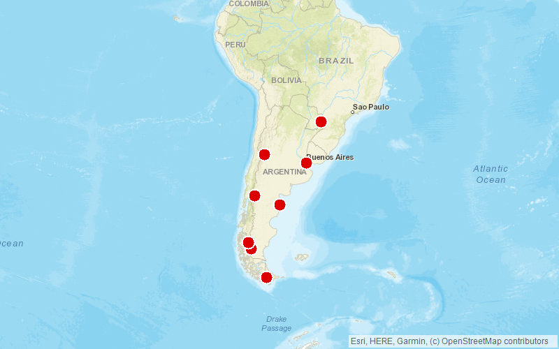
[View Full Route on Google Maps ↗](https://www.google.com/maps/dir/Buenos+Aires,+Argentina/Puerto+Iguaz%C3%BA,+Misiones,+Argentina/Buenos+Aires,+Argentina/Puerto+Madryn,+Chubut,+Argentina/Ushuaia,+Tierra+del+Fuego,+Argentina/El+Calafate,+Santa+Cruz,+Argentina/El+Chalt%C3%A9n,+Santa+Cruz,+Argentina/San+Carlos+de+Bariloche,+R%C3%ADo+Negro,+Argentina/Mendoza,+Argentina/Buenos+Aires,+Argentina)

---

## ✈️ Domestic Flights

| # | Date | Route | Airports |
|---|------|-------|----------|
| 1 | Dec 11 | Buenos Aires → Puerto Iguazú | EZE → IGR |
| 2 | Dec 13 | Puerto Iguazú → Buenos Aires | IGR → AEP |
| 3 | Dec 14 | Buenos Aires → Puerto Madryn | AEP → PMY |
| 4 | Dec 17 | Puerto Madryn → Ushuaia | PMY → USH |
| 5 | Dec 20 | Ushuaia → El Calafate | USH → FTE |
| 6 | Dec 26 | El Calafate → Bariloche | FTE → BRC |
| 7 | Jan 1 | Bariloche → Mendoza | BRC → MDZ |
| 8 | Jan 3 | Mendoza → Buenos Aires | MDZ → EZE |

> **Airlines**: Aerolíneas Argentinas (most reliable), JetSMART, Flybondi (cheaper). Book all flights early — December/January is peak season.

---

## 🚗 Car Rental Summary

| Destination | Dates | Days | Why Essential |
|-------------|-------|------|---------------|
| Puerto Madryn | Dec 14–16 | 3 | Península Valdés & Punta Tombo have NO public transport |
| Ushuaia | Dec 17–19 | 3 | Tierra del Fuego NP, Beagle Channel scenic drives |
| Bariloche | Dec 26–31 | 6 | Circuito Chico, Seven Lakes / Circuito Grande, Cerro Tronador |

> **Tip**: At Bariloche, book an AWD/SUV if possible — the Tronador road is unpaved gravel.

---

## ⚠️ Advance Booking Priorities

Book these **before anything else**:

1. 🏨 **Bariloche NYE hotel** — Book 6–12 months in advance. Dec 31 sells out a full year ahead.
2. 🧊 **Perito Moreno Ice Trek** (Mini-trekking or Big Ice) — Book 2–3 months ahead.
3. 🐧 **Martillo Island penguin boat tour** (Ushuaia) — Very limited capacity. Book 1–2 months ahead.
4. ✈️ **All 8 domestic flights** — Book ASAP. Prices rise sharply near travel dates.
5. 🍷 **Mendoza winery tours** — January is high season; reserve tables well in advance.
6. 🐋 **Península Valdés whale-watching** — Book 2–4 weeks ahead.

---

## Day-by-Day Itinerary

---

### 🏙️ Buenos Aires

**Dec 9–10 · 2 nights**

*"The Paris of South America" — tango, steak, grand boulevards, and European-style architecture*

<table width="100%" border="0" cellspacing="4" cellpadding="0"><tr>
<td colspan="2">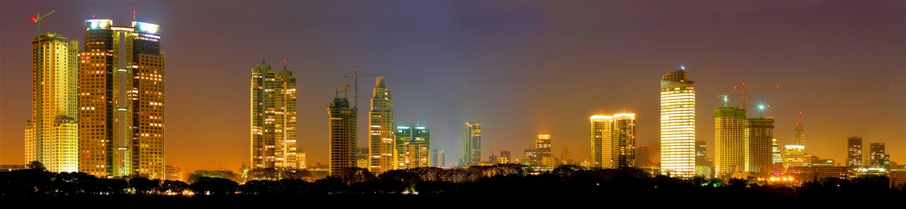</td>
</tr><tr>
<td>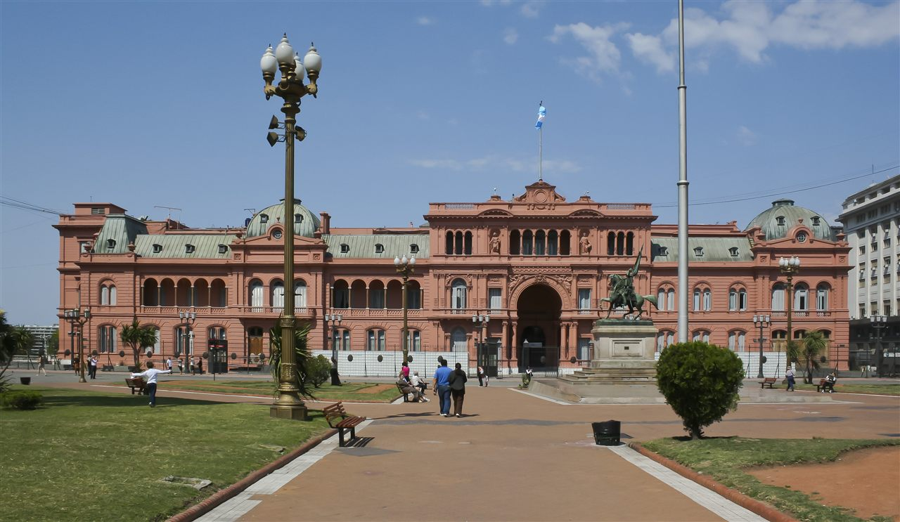</td>
<td>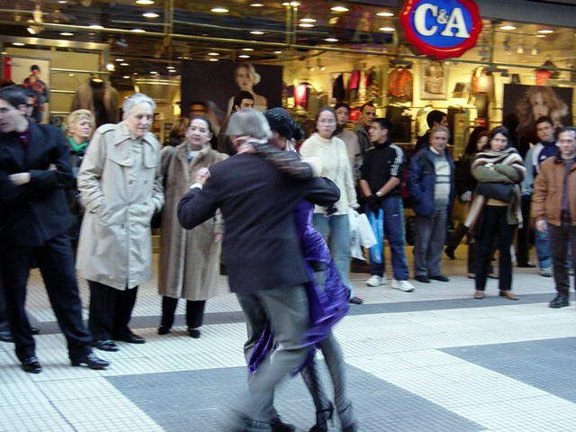</td>
</tr><tr>
<td>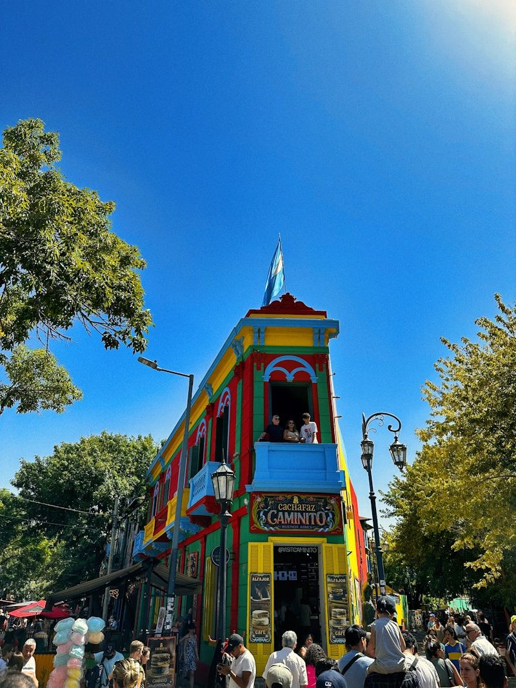</td>
<td>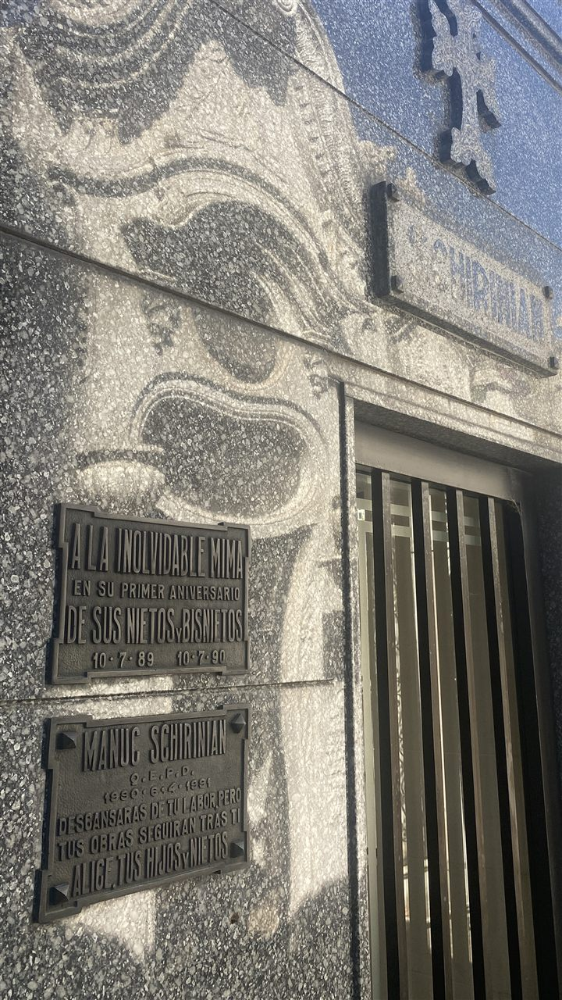</td>
</tr></table>

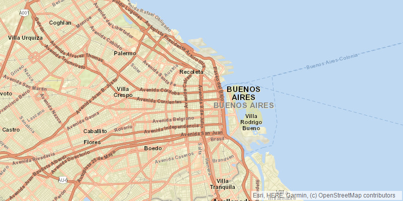
[View on Google Maps ↗](https://www.google.com/maps/place/Buenos+Aires,+Argentina/@-34.6037,-58.3816,13z)

---

#### Day 1 · Wednesday, Dec 9 — Arrival

- **05:40** — Land at **Ministro Pistarini International Airport (EZE)**
- **Immigration & customs**: Allow 1–2 hours. Have accommodation address ready.
- **Transfer**: Pre-book a remise (private car) or use the official taxi stand — **~45 min, ~$25–35 USD** to Palermo/Recoleta. Avoid unofficial taxis.
- **Morning**: Check in early if possible; otherwise store bags and get breakfast at a café.
- **Afternoon**: Rest and recover. Stroll around your neighbourhood (Palermo or Recoleta).
- **Evening**: First dinner at a **parrilla** (Argentine steakhouse). Order a *bife de chorizo* or *ojo de bife* and a bottle of Malbec. You have arrived.

| | |
|---|---|
| **Stay** | Hotel in Palermo or Recoleta |
| **Tip** | Palermo = trendy bars/restaurants; Recoleta = elegant, central |

---

#### Day 2 · Thursday, Dec 10 — Sightseeing

- **Morning**: Walk from **Plaza de Mayo** (the political heart of Argentina) → **Casa Rosada** (the Pink House) → **Buenos Aires Metropolitan Cathedral** → stroll south through the historic **Montserrat** quarter to **San Telmo**.
- **Afternoon**: Take a taxi to **La Boca / Caminito** — the colourful, Genoese-influenced neighbourhood with street art and tango dancers. *(Do not walk there from San Telmo — take a cab and stay within the main tourist area.)*
- **Late afternoon**: **Recoleta Cemetery** — monumental mausoleums, final resting place of Eva Perón (Evita). Walk through the elegant Recoleta neighbourhood.
- **Optional culture add-on**: If timing works, add a guided visit to **Teatro Colón** before dinner rather than trying to squeeze in another neighbourhood.
- **Evening**: Optional **tango dinner show** (highly recommended — try Café de los Angelitos or El Viejo Almacén), or dinner in Palermo Hollywood.
- **Early night**: You have an early flight tomorrow.

| | |
|---|---|
| **Stay** | Hotel in Palermo or Recoleta |
| **Note** | Tomorrow's flight departs from **EZE** — budget ~1h 30min transfer to airport |

---

### 🌊 Puerto Iguazú

**Dec 11–12 · 2 nights**

*Wider than Niagara, taller than Victoria Falls — one of the world's great natural wonders*

<table width="100%" border="0" cellspacing="4" cellpadding="0"><tr>
<td colspan="3">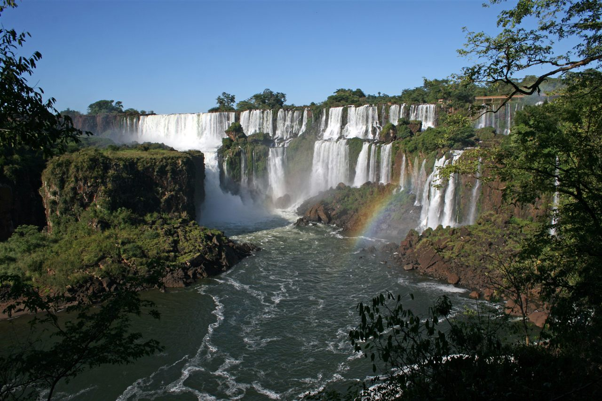</td>
<td colspan="3">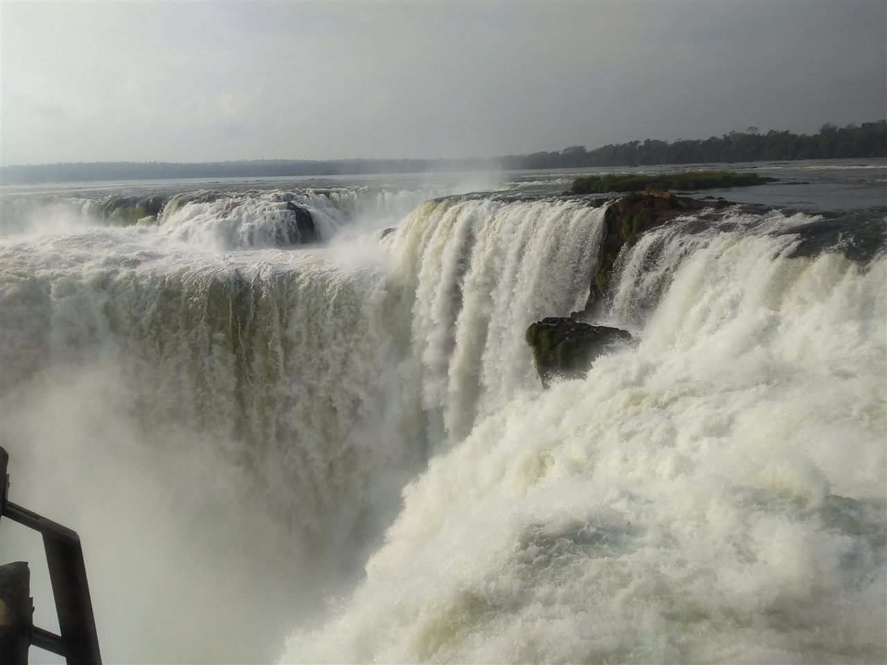</td>
</tr><tr>
<td colspan="2">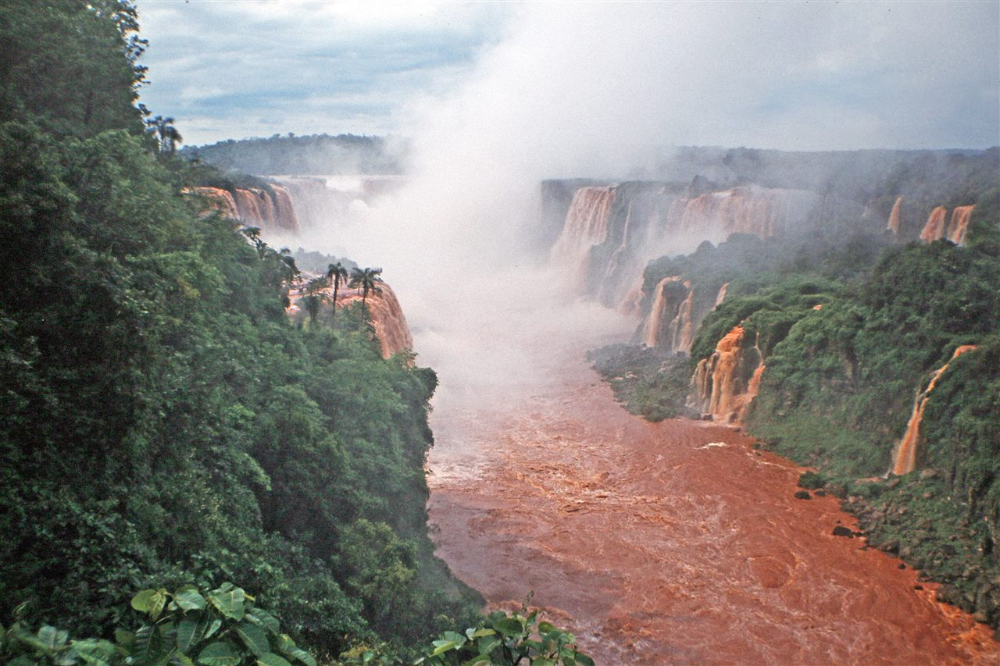</td>
<td colspan="2">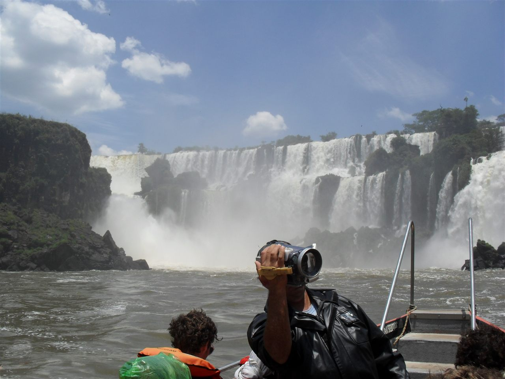</td>
<td colspan="2">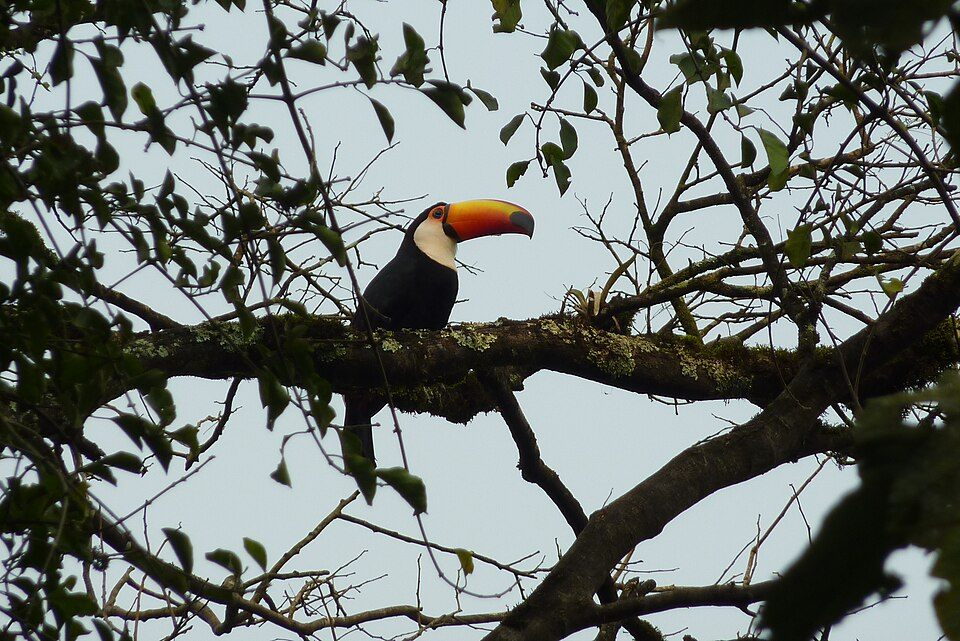</td>
</tr></table>

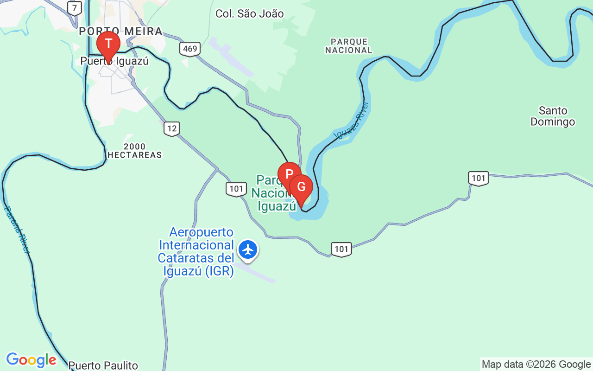
[View on Google Maps ↗](https://www.google.com/maps/place/Iguaz%C3%BA+National+Park/@-25.69,-54.44,11z)

---

#### Day 3 · Friday, Dec 11 — Travel + Argentine Side of the Falls

- **Morning**: Flight **EZE → IGR** (~2 hrs). Hotel check-in in Puerto Iguazú town (~8 km from the park).
- **Afternoon**: Visit **Parque Nacional Iguazú (Argentine side)**:
  - **Upper Circuit** (Circuito Superior) — walkway above the falls
  - **Lower Circuit** (Circuito Inferior) — get close to the base
  - **Garganta del Diablo (Devil's Throat)** — the centrepiece: a 150m-wide horseshoe cataract. Stand at the railing as millions of litres pour past you. Unforgettable.
  - Optional: ecological train through the jungle between circuits
- **Evening**: Return to Puerto Iguazú. Dinner at a local restaurant — try *surubí* (river fish).

| | |
|---|---|
| **Stay** | Hotel in Puerto Iguazú town |
| **Note** | Bring a change of clothes or rain poncho — the Devil's Throat will soak you |

---

#### Day 4 · Saturday, Dec 12 — Brazilian Side

> **⚠️ Visa Check**: As of 2025, Israeli passport holders **do not need a Brazilian visa** for short tourist visits. Verify this before travel. If anything changes, use this day for a second full day on the Argentine side (it's huge — very worth it).

- **Morning**: Day trip to **Foz do Iguaçu, Brazil** (30-min drive; border crossing). The **Brazilian side** offers the legendary panoramic view of the entire horseshoe — the photo that's on every postcard.
- **Afternoon**: Optional **Macuco Boat Safari** — a speedboat ride to the base of the falls. You WILL be completely drenched. Absolutely worth it.
- **Evening**: Return to Puerto Iguazú. Dinner and relax.

| | |
|---|---|
| **Stay** | Hotel in Puerto Iguazú |
| **Note** | Bring your passport for the Brazil border crossing |

---

### ✈️ Buenos Aires (Transit)

**Dec 13 · 1 night**

[View on Google Maps ↗](https://www.google.com/maps/place/Buenos+Aires,+Argentina/@-34.6037,-58.3816,13z)

---

#### Day 5 · Sunday, Dec 13 — Transit Day

- **Morning**: Flight **IGR → AEP** (Aeroparque Jorge Newbery, the domestic airport — central Buenos Aires, ~2 hrs).
- **Afternoon**: Check in to hotel near Aeroparque or Palermo. Leave bags. Easy afternoon in **Palermo** — the parks, Palermo Soho boutiques, bookstores.
- **Evening**: Dinner in Palermo or the Recoleta neighbourhood. Early night — you have an early flight tomorrow.

| | |
|---|---|
| **Stay** | Hotel near Aeroparque (AEP) — Palermo or Las Cañitas |
| **Note** | Tomorrow's flight departs from **AEP** — a 15-min taxi ride |

---

### 🐋 Puerto Madryn / Península Valdés

**Dec 14–16 · 3 nights**

*UNESCO World Heritage Site — the world's finest wildlife sanctuary for right whales, elephant seals, sea lions and penguins*

<table width="100%" border="0" cellspacing="4" cellpadding="0"><tr>
<td colspan="2">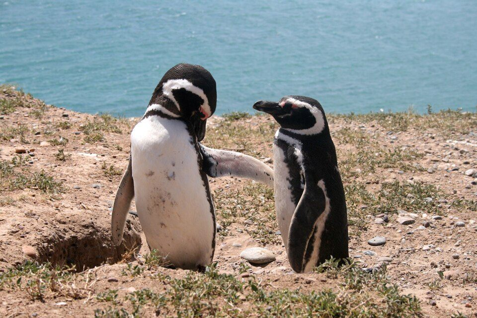</td>
<td colspan="2">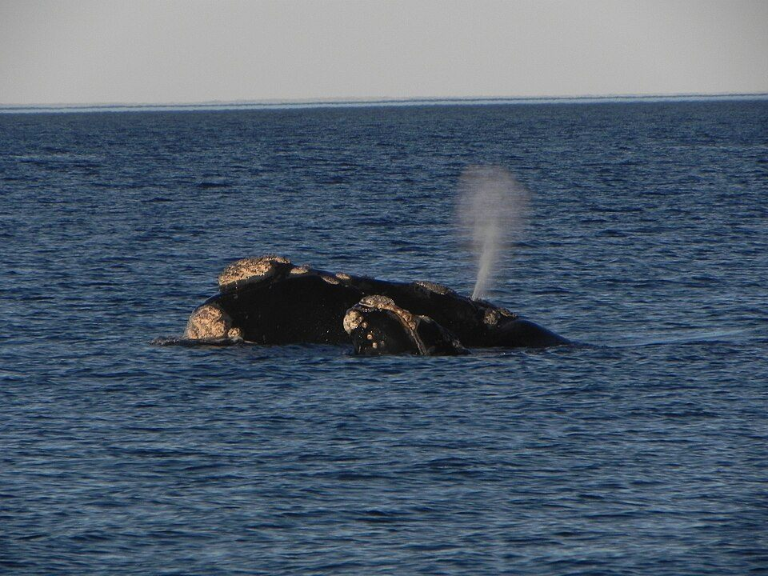</td>
<td colspan="2">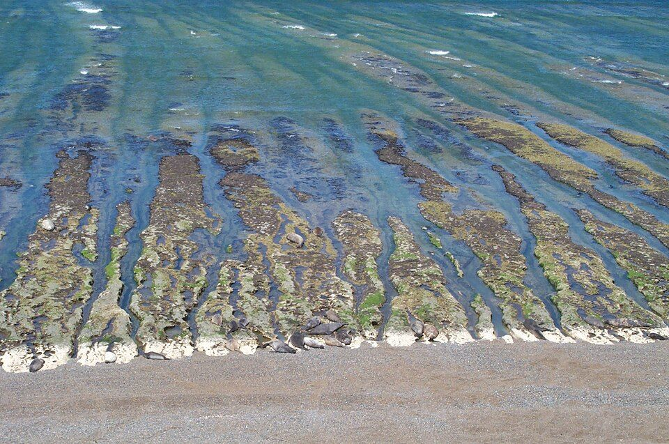</td>
</tr><tr>
<td colspan="3">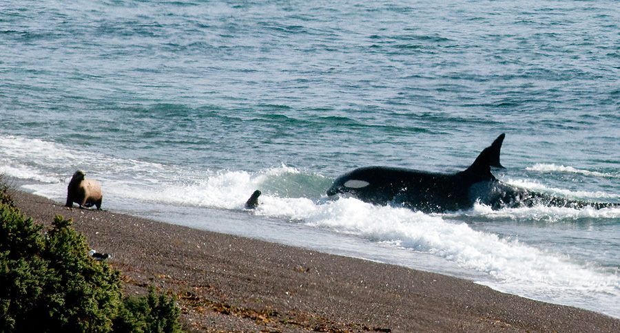</td>
<td colspan="3">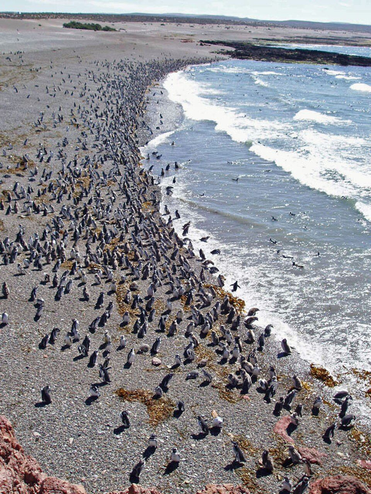</td>
</tr></table>

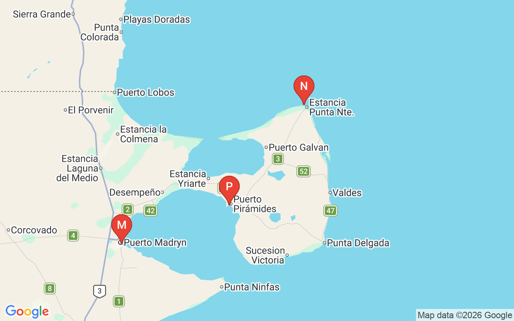
[View on Google Maps ↗](https://www.google.com/maps/place/Pen%C3%ADnsula+Vald%C3%A9s/@-42.4,-64.0,9z)

---

#### Day 6 · Monday, Dec 14 — Travel + Punta Tombo

- **Morning**: Flight **AEP → PMY** (~2 hrs). Pick up **rental car** at Puerto Madryn airport.
- **Afternoon**: Drive south to **Punta Tombo** (~180 km, ~2 hrs). This is the **largest Magellanic penguin colony in the world** — approximately 1 million penguins in December! A boardwalk trail lets you walk right among them as they ignore you completely. Extraordinary.
- **Evening**: Drive back to Puerto Madryn (~2 hrs). Dinner by the waterfront.

| | |
|---|---|
| **Stay** | Hotel in Puerto Madryn |
| **Distance** | Punta Tombo is 180 km south; allow a full 4–5 hrs for the visit + driving |

---

#### Day 7 · Tuesday, Dec 15 — Península Valdés Full Day

- **Morning**: Drive to **Península Valdés** (80 km, ~1 hr). Pay park entry fee at the gate. Head to **Puerto Pirámides** for a **whale-watching boat tour** — December is peak season for **southern right whale** mothers and calves. Breathtaking up close.
- **Afternoon**: Drive around the peninsula:
  - **Punta Norte** — colony of **elephant seals** and **South American sea lions**. September–March is breeding season; December has massive animals and pups.
  - **Caleta Valdés** — more elephant seals along stunning cliffs. Watch for orcas offshore.
  - Keep eyes open for **guanacos, rheas (ñandú), and Patagonian maras** en route.
- **Evening**: Return to Puerto Madryn. Dinner with fresh Patagonian seafood — try *merluza* (hake) or *camarones* (prawns).

| | |
|---|---|
| **Stay** | Hotel in Puerto Madryn |
| **Tip** | Binoculars essential. Bring snacks — restaurants on the peninsula are limited |

---

#### Day 8 · Wednesday, Dec 16 — Free Morning + Prep

- **Morning**: Optional return to the peninsula for anything missed, or explore Puerto Madryn seafront. The **EcoCentro** (marine biology museum on a cliff) is excellent if open.
- **Afternoon**: Return rental car to airport. Rest. Pack for Ushuaia — you'll need warm layers even in December.
- **Evening**: Last dinner in Puerto Madryn. Early night — flight to Ushuaia tomorrow.

| | |
|---|---|
| **Stay** | Hotel in Puerto Madryn |
| **Pack** | Wind/waterproof jacket, layers — Ushuaia is cold and unpredictable even in summer |

---

### 🐧 Ushuaia

**Dec 17–19 · 3 nights**

*The southernmost city in the world — "Fin del Mundo" (End of the World). Gateway to Antarctica.*

<table width="100%" border="0" cellspacing="4" cellpadding="0"><tr>
<td colspan="2">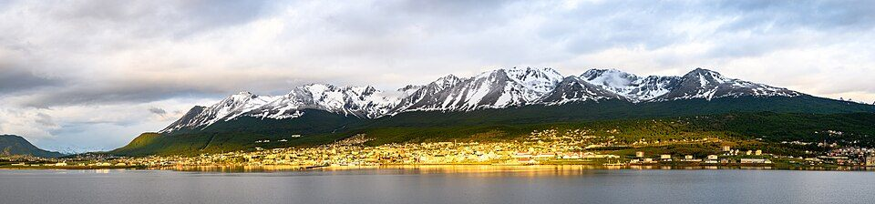</td>
</tr><tr>
<td>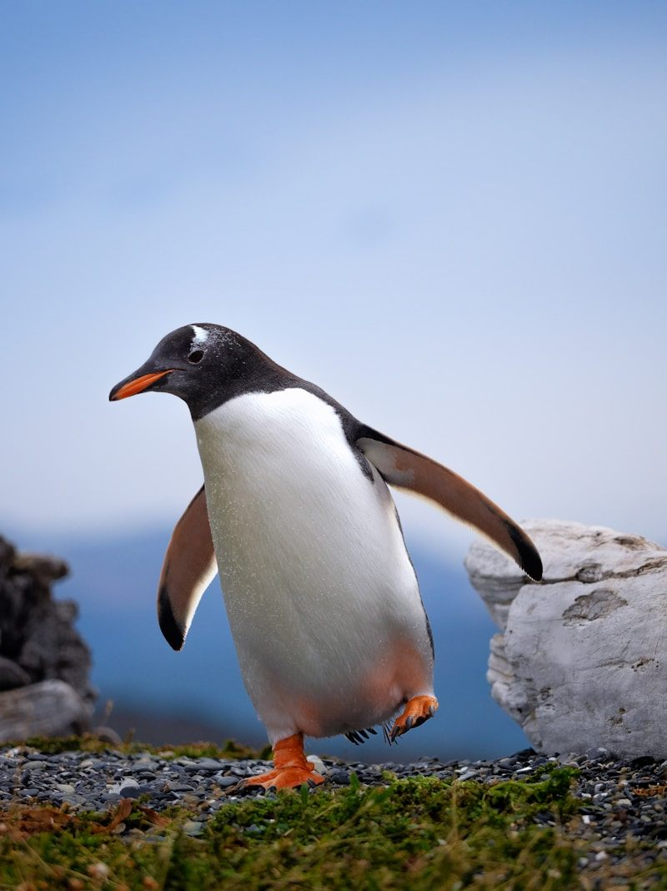</td>
<td>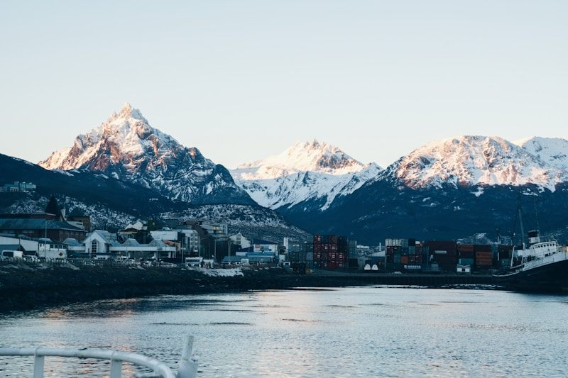</td>
</tr><tr>
<td>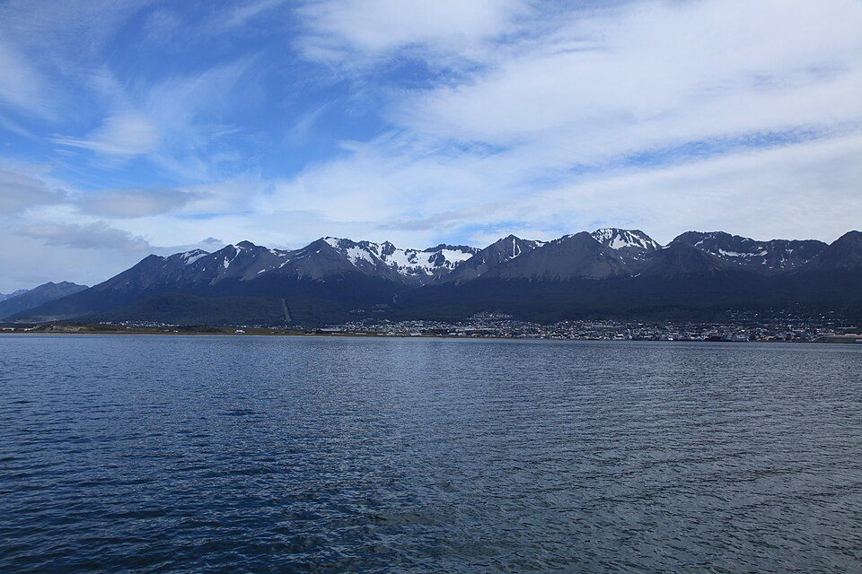</td>
<td>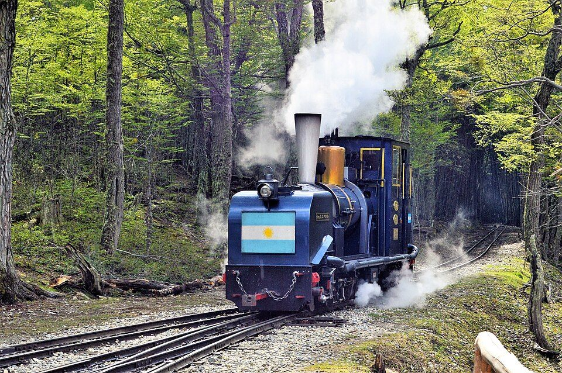</td>
</tr></table>

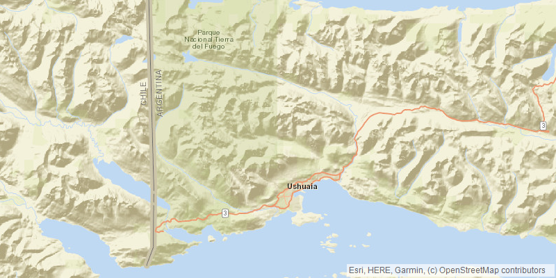
[View on Google Maps ↗](https://www.google.com/maps/place/Ushuaia,+Tierra+del+Fuego,+Argentina/@-54.8019,-68.3030,12z)

---

#### Day 9 · Thursday, Dec 17 — Travel + Tierra del Fuego National Park

- **Morning**: Flight **PMY → USH** (~2.5 hrs). Pick up **rental car** at Ushuaia airport.
- **Afternoon**: Drive west to **Parque Nacional Tierra del Fuego** (~12 km):
  - Hike the **Senda Costera** (coastal trail along the Beagle Channel) — easy to moderate, stunning views.
  - Walk to the **Lapataia Bay** — the literal end of **Ruta Nacional 3**, the Pan-American Highway (Buenos Aires: 3,079 km). Photo stop essential.
  - Visit the **End of the World Train** (Tren del Fin del Mundo) station.
- **Evening**: Return to Ushuaia. Dinner — order **centolla (king crab)** — the local specialty. A Ushuaia tradition.

| | |
|---|---|
| **Stay** | Hotel in Ushuaia |
| **Note** | December: ~18 hrs daylight. You will not run out of light |

---

#### Day 10 · Friday, Dec 18 — Martillo Island Penguins + Beagle Channel

- **Morning**: **Boat tour to Isla Martillo (Martillo Island)** — the only place in the world outside Antarctica where you can **walk among king penguins** on guided land excursions. Also Magellanic penguins in abundance. Tours depart from Puerto Almanza or from Ushuaia docks. **Book well in advance — capacity extremely limited.**
- **Afternoon**: Drive the scenic route along the Beagle Channel back towards town. Stop at panoramic lookouts. Optional: visit the **Presidio (old prison/museum)** or **Museo del Fin del Mundo**.
- **Evening**: Dinner in Ushuaia — try local lamb (*cordero patagónico*) or king crab again.

| | |
|---|---|
| **Stay** | Hotel in Ushuaia |
| **Note** | Martillo Island tours: book 4–8 weeks ahead. Limited to ~20 people per excursion |

---

#### Day 11 · Saturday, Dec 19 — Free Day + Pack Up

- **Morning**: Choose your adventure:
  - Hike up **Cerro Martial** for panoramic views over Ushuaia and the Beagle Channel (~3 hrs round-trip, moderate)
  - Kayaking in the Beagle Channel
  - **Lago Escondido / Lago Fagnano** scenic drive east (~150 km round-trip — big lakes straddling Chile border)
- **Afternoon**: Return rental car. Explore **Ushuaia's artisan market and shops** — pick up Tierra del Fuego crafts, local chocolates, and the famous "End of the World" stamps for your passport.
- **Evening**: Last dinner in Ushuaia. Early night.

| | |
|---|---|
| **Stay** | Hotel in Ushuaia |
| **Note** | Flight to El Calafate tomorrow — no onward car rental needed there |

---

### 🧊 El Calafate

**Dec 20–22 · 3 nights + Dec 25 · 1 night (return)**

*Gateway to Los Glaciares National Park — home of the world's most accessible and spectacular glacier*

<table width="100%" border="0" cellspacing="4" cellpadding="0"><tr>
<td colspan="3">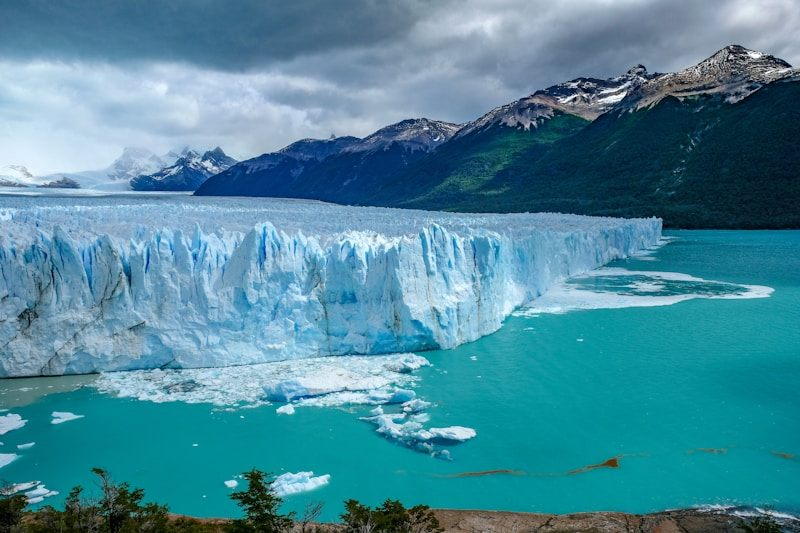</td>
<td colspan="3">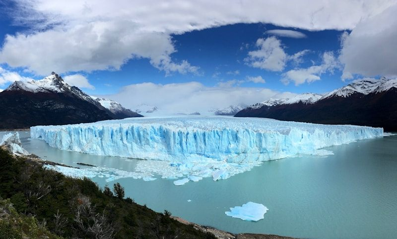</td>
</tr><tr>
<td colspan="2">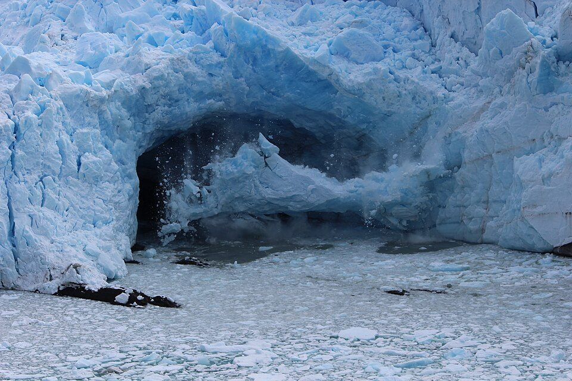</td>
<td colspan="2">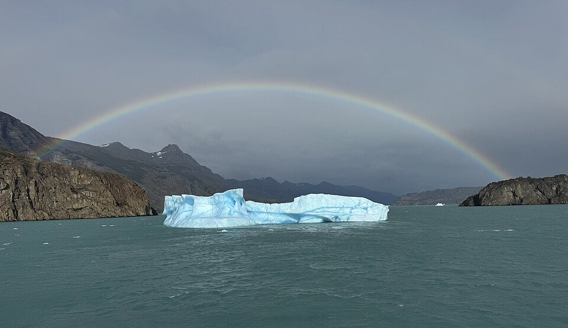</td>
<td colspan="2">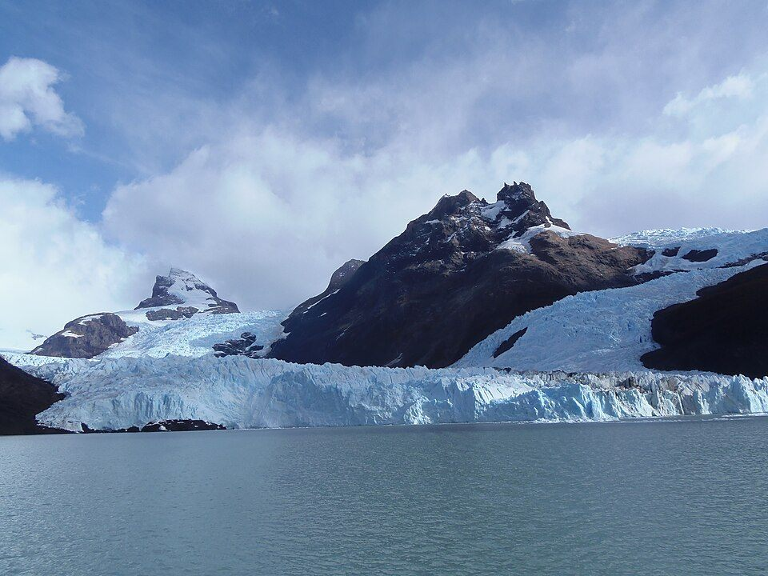</td>
</tr></table>

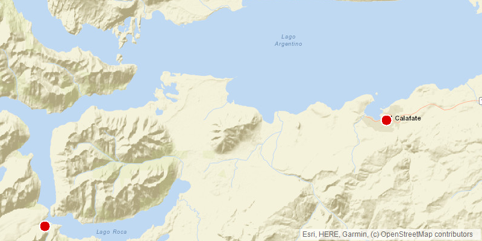
[View on Google Maps ↗](https://www.google.com/maps/place/Perito+Moreno+Glacier/@-50.4934,-73.0479,11z)

---

#### Day 12 · Sunday, Dec 20 — Travel + Orientation

- **Morning**: Flight **USH → FTE** (~1.5 hrs). Check in to hotel in El Calafate.
- **Afternoon**: Walk along the turquoise shore of **Lago Argentino** — one of the world's largest lakes. Visit the **Glaciarium** (glacier museum) if interested, with 3D film about the Southern Patagonian Ice Field.
- **Evening**: Dinner in El Calafate. The town has excellent restaurants — try **Patagonian lamb**.

> **💵 CASH WARNING**: Withdraw a generous amount of **Argentine pesos** at an El Calafate ATM before heading to El Chaltén. **El Chaltén has NO ATM and minimal card payment options.** Budget for 2 nights of meals, drinks, and incidentals. Bring more than you think you need.

| | |
|---|---|
| **Stay** | Hotel in El Calafate |

---

#### Day 13 · Monday, Dec 21 — Perito Moreno Glacier

**This is one of the top natural spectacles on Earth. Give it a full day.**

- **Full Day**: **Glaciar Perito Moreno** — 78 km west of El Calafate (take a tour or hire a remise — no car rental needed):
  - The **pasarelas** (walkways) along the southern and eastern flanks give you close-up views of the 5-km-wide, 74-m-tall ice wall — for FREE after park entry.
  - Watch and listen for **calving** — cathedral-sized chunks of ice exploding into the lake with a deafening crack. Happens constantly.
  - **Book a guided ice trek**: **Mini-Trekking** (~1.5 hrs on the glacier with crampons) is the popular option. **Big Ice** (~5 hrs) is for the more adventurous. Both require advance booking months ahead.
  - **Boat tour option**: Some operators offer a zodiac tour that approaches the glacier wall from the water.
- **Evening**: Return to El Calafate. Celebratory dinner.

| | |
|---|---|
| **Stay** | Hotel in El Calafate |
| **Book ahead** | Ice trek tours (Mini-Trekking or Big Ice) — 2–3 months ahead at minimum |

---

#### Day 14 · Tuesday, Dec 22 — Lago Argentino Boat Tour + Rest

- **Morning**: **Lago Argentino boat excursion** — sail past the vast **Upsala Glacier** (one of South America's largest, though retreating) and **Spegazzini Glacier** (with ice walls rising 135 m above water — the tallest accessible glacier face in the world). Full-day tours available.
- **Afternoon**: Rest and prepare for El Chaltén tomorrow. Buy food/snacks for the bus, and **withdraw your cash now**.
- **Evening**: Dinner and early night — the bus to El Chaltén leaves early.

| | |
|---|---|
| **Stay** | Hotel in El Calafate |

---

### ⛰️ El Chaltén

**Dec 23–24 · 2 nights**

*Argentina's trekking capital, population ~1,500 — home to Fitz Roy and Cerro Torre*

<table width="100%" border="0" cellspacing="4" cellpadding="0"><tr>
<td colspan="3">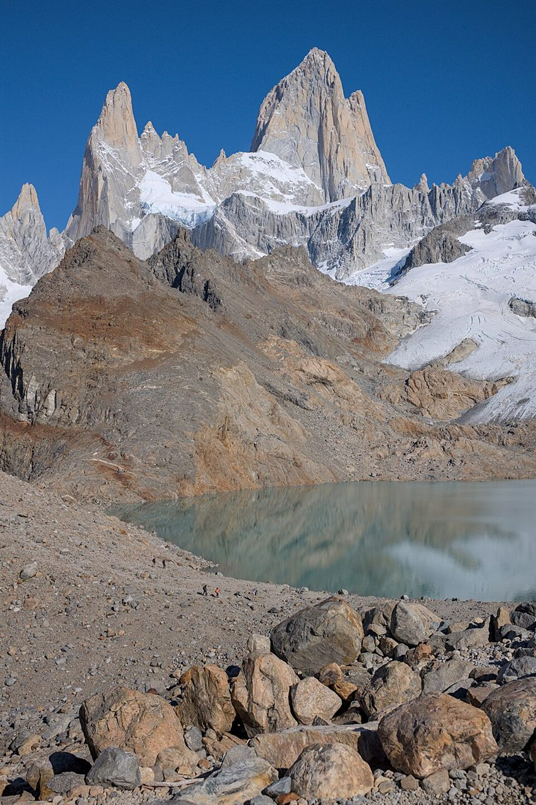</td>
<td colspan="3">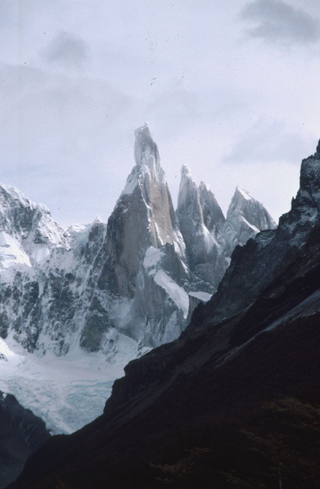</td>
</tr><tr>
<td colspan="2">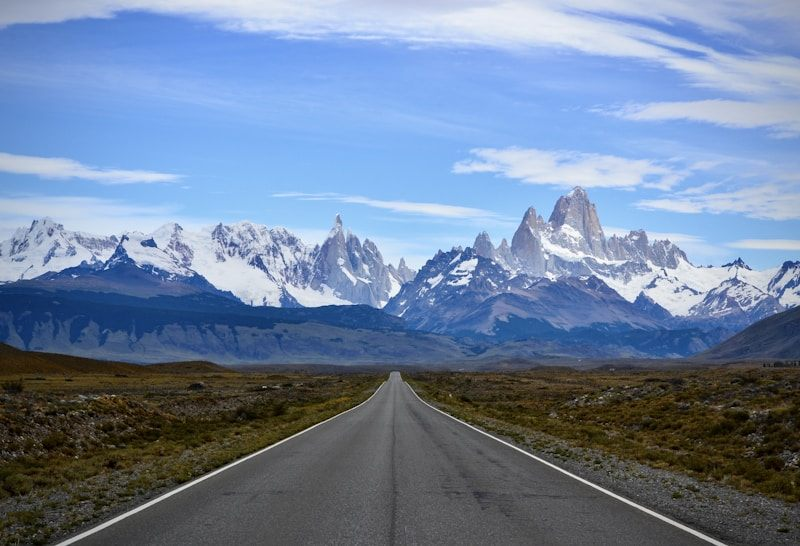</td>
<td colspan="2">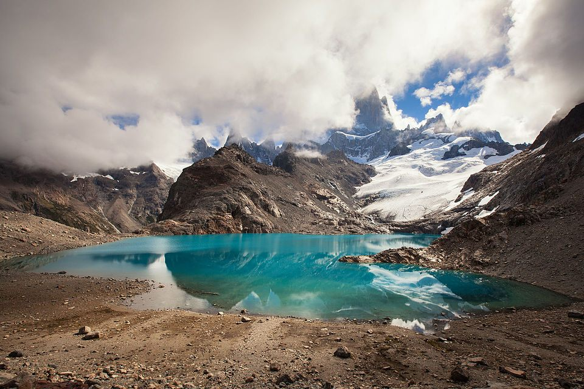</td>
<td colspan="2">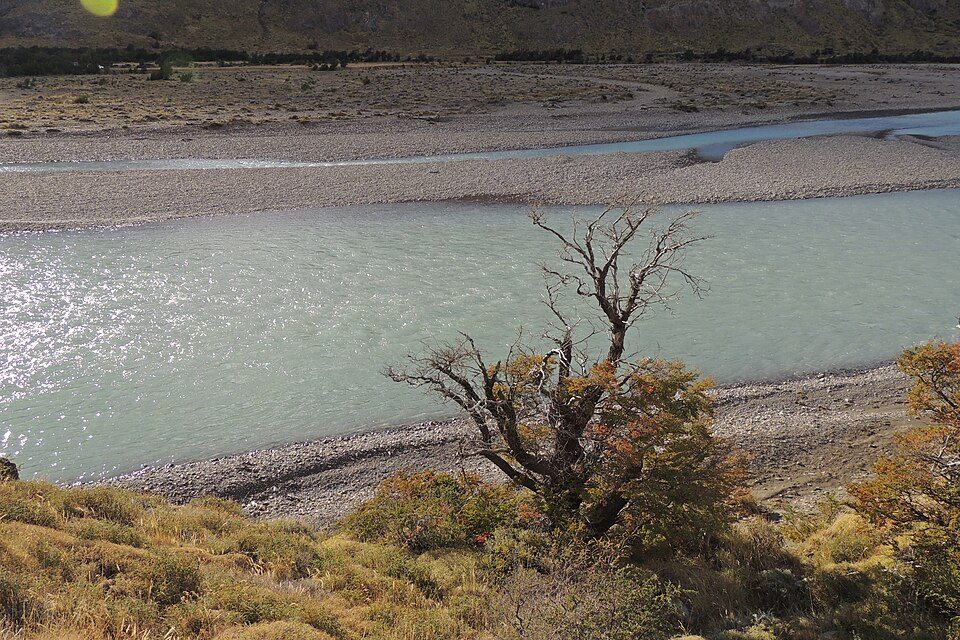</td>
</tr></table>

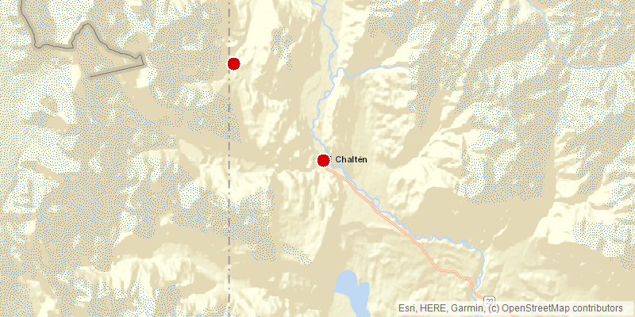
[View on Google Maps ↗](https://www.google.com/maps/place/El+Chalt%C3%A9n,+Santa+Cruz,+Argentina/@-49.3310,-72.8855,11z)

---

#### Day 15 · Wednesday, Dec 23 — Bus to El Chaltén + Laguna de los Tres

- **Morning**: **Bus from El Calafate to El Chaltén** (~3 hrs, ~220 km via RN40). Buses typically depart 7–8 am from El Calafate bus terminal. Book in advance.
- **Late morning**: Arrive El Chaltén. Drop bags at hotel. Trails start right at the edge of the village — **no entry fees**, national park rangers give free orientation talks at the bus terminal.
- **Afternoon**: Start the **Laguna de los Tres trail** — the iconic Fitz Roy hike:
  - 20 km round-trip, ~1,200 m elevation gain
  - 6–8 hours total
  - The payoff at the top: Fitz Roy (3,405 m) reflected in the turquoise glacial lagoon. One of the great views in all of South America.
- **Evening**: Return to town. Dinner — El Chaltén has surprisingly excellent restaurants for such a tiny place. Toast to the hike.

| | |
|---|---|
| **Stay** | Hotel or cabin in El Chaltén |
| **Weather** | Patagonian weather is notoriously changeable. Check the morning forecast — reschedule hikes if winds are severe |

---

#### Day 16 · Thursday, Dec 24 — Laguna Torre + Christmas Eve

- **Morning/Afternoon**: Hike to **Laguna Torre** for views of the needle-like **Cerro Torre** (one of the world's most technically demanding climbs):
  - 18 km round-trip, moderate difficulty
  - 5–6 hours total
  - On clear days, views of the floating hanging glaciers on Cerro Torre's peak are extraordinary.
  - *First cut if needed*: If Day 15 ran long, legs are cooked, or the weather turns ugly, drop this full hike before forcing it and switch to **Chorrillo del Salto** waterfall (~4 km round-trip).
- **Evening**: **Christmas Eve (Nochebuena)** dinner — many El Chaltén restaurants serve special menus. Toast with local craft beer (El Chaltén has a microbrewery). Celebrate one of the most spectacular 48 hours of the trip.

| | |
|---|---|
| **Stay** | Hotel or cabin in El Chaltén |

---

### 🧊 El Calafate (Return)

**Dec 25 · 1 night**

[View on Google Maps ↗](https://www.google.com/maps/place/Perito+Moreno+Glacier/@-50.4934,-73.0479,11z)

---

#### Day 17 · Friday, Dec 25 — Bus Back + Christmas Day

- **Morning**: Bus back from El Chaltén to El Calafate (~3 hrs). Arrive around midday.
- **Afternoon**: Rest at the hotel. Optional visit to the **Glaciarium** museum if not already visited. Explore El Calafate's shops.
- **Evening**: **Christmas dinner** (Navidad) — Argentine restaurants are typically open and many offer special menus. Lamb and Malbec recommended.

| | |
|---|---|
| **Stay** | Hotel in El Calafate |
| **Note** | Flight to Bariloche tomorrow morning |

---

### 🍫 Bariloche

**Dec 26–31 · 6 nights · NEW YEAR'S EVE!**

*"The Queen of Patagonia" — alpine lakes, Andean scenery, Swiss-style architecture, world-class chocolate, and one of Argentina's biggest NYE celebrations*

<table width="100%" border="0" cellspacing="4" cellpadding="0"><tr>
<td colspan="3">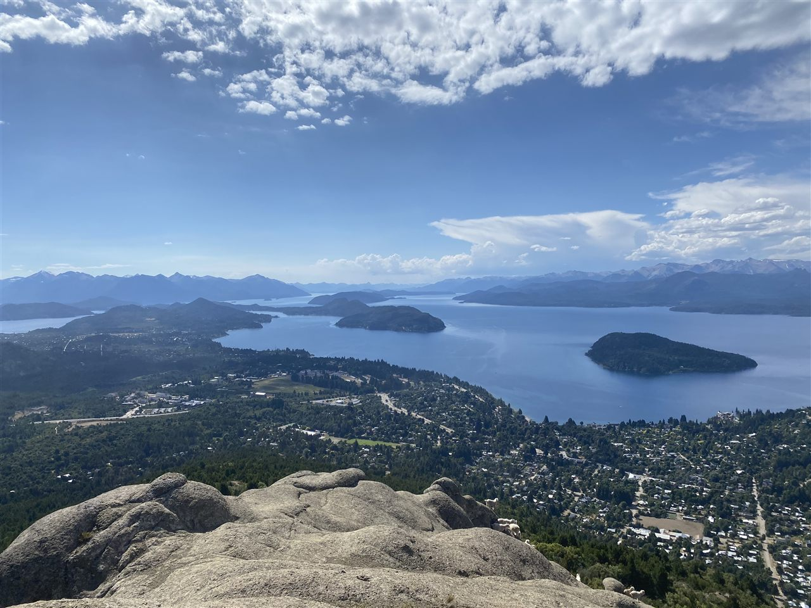</td>
<td colspan="3">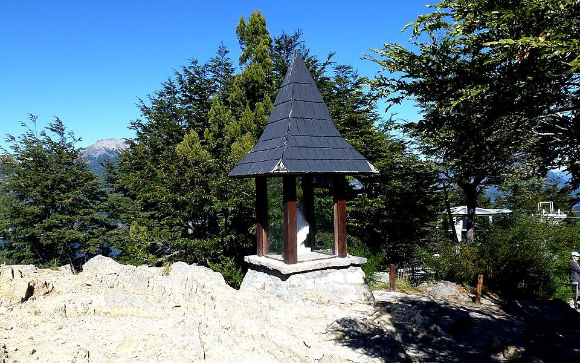</td>
</tr><tr>
<td colspan="2">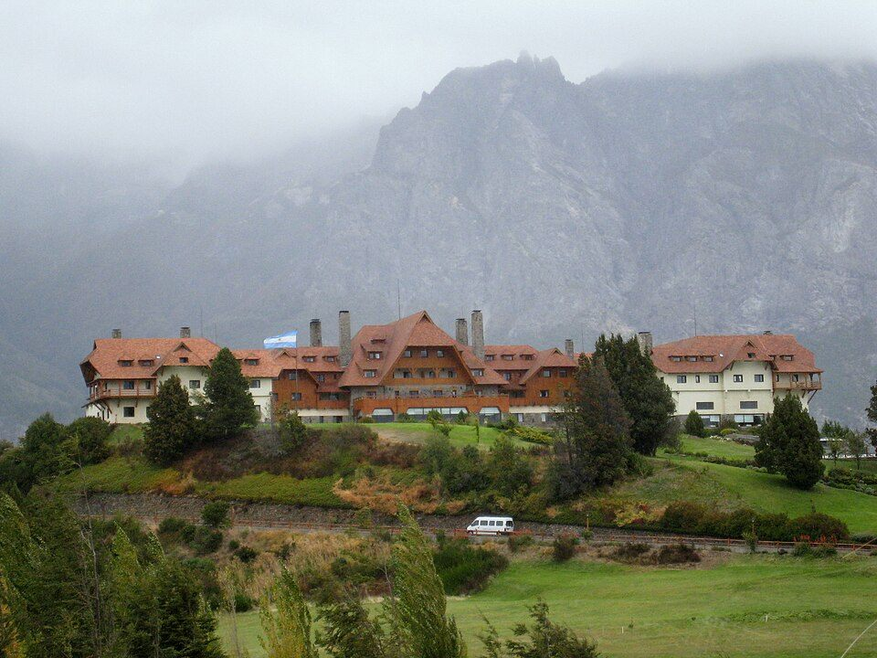</td>
<td colspan="2">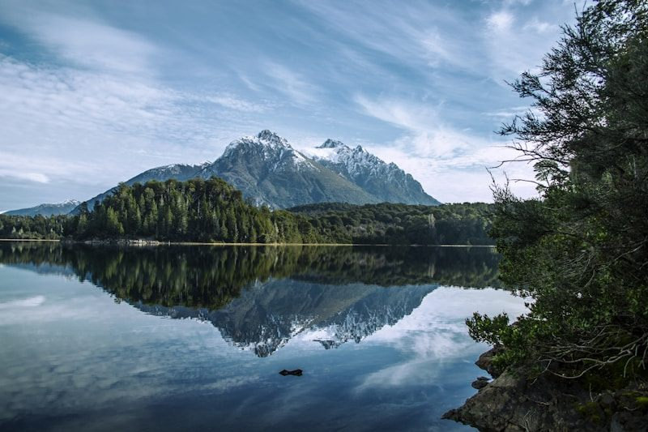</td>
<td colspan="2">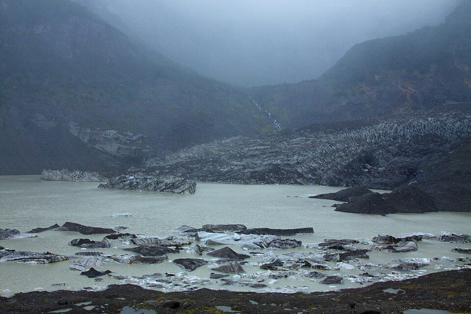</td>
</tr></table>

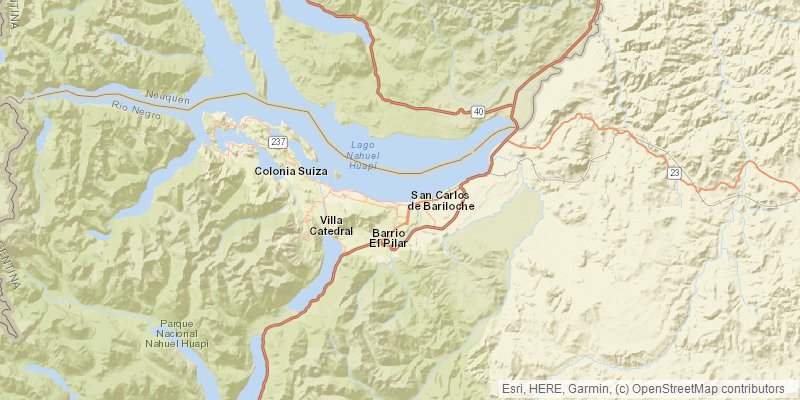
[View on Google Maps ↗](https://www.google.com/maps/place/San+Carlos+de+Bariloche,+R%C3%ADo+Negro,+Argentina/@-41.1335,-71.3103,11z)

---

#### Day 18 · Saturday, Dec 26 — Flight to Bariloche + Arrival

- **Morning**: Flight **FTE → BRC** (~2 hrs). **Pick up rental car** at Bariloche airport.
- **Afternoon**: Check in to hotel (booked months ago!). Drive to the iconic **Civic Centre** (tuff-stone alpine architecture declared a national monument). Walk the **Nahuel Huapi Lake** waterfront and browse the famous **chocolate shops** — Bariloche is Argentina's chocolate capital.
- **Evening**: Dinner by the lake. Welcome to the Lakes District.

| | |
|---|---|
| **Stay** | Hotel in Bariloche (pre-booked well in advance!) |

---

#### Day 19 · Sunday, Dec 27 — Circuito Chico

- **Must-do**: Drive the **Circuito Chico** (~60 km loop west of Bariloche) and go up **Cerro Campanario** — 35-min hike (or chairlift) to Argentina's most-photographed panoramic viewpoint: Nahuel Huapi Lake, islands and Andes in all directions.
- **Strong additions**:
  - **Llao Llao Hotel** — the legendary 1938 alpine hotel. Walk the beautiful grounds; have a coffee if budget allows.
  - **Puerto Pañuelo** — beautiful dock with views back to the hotel and across the lake.
  - **Lago Moreno** viewpoints.
- **Nice if energy allows**: Leave extra time for a lakeside stop or short walk rather than rushing the loop.
- **Evening**: Return to Bariloche. Dinner.

| | |
|---|---|
| **Stay** | Hotel in Bariloche |

---

#### Day 20 · Monday, Dec 28 — Cerro Tronador

- **Must-do**: Give **Cerro Tronador** the day it deserves. Drive south through native Valdivian forest, visit the **Ventisquero Negro** (the "black glacier" — a dramatic dark-streaked hanging glacier), and take in the gorge of the Manso River.
- **Nice if energy allows**: Add only a short extra stop on the return. Do **not** count on fitting **Cerro Catedral** into the same day unless you start very early and are happy with an unusually long outing.
- **Evening**: Return to Bariloche. This is one of the biggest road days of the trip.

| | |
|---|---|
| **Stay** | Hotel in Bariloche |
| **Note** | The road to Ventisquero Negro is partly unpaved; AWD recommended |

---

#### Day 21 · Tuesday, Dec 29 — Lakes District Road Trip

- **Strongest recommendation**: Drive the **Route of the Seven Lakes** toward **San Martín de los Andes**, a classic Lakes District outing linking standout lakes such as **Correntoso**, **Escondido**, and **Lácar** with mountain scenery all day.
- **Strong alternative**: Keep the current **Circuito Grande** (~250 km loop north of Bariloche) if you prefer a somewhat shorter Bariloche-based loop:
  - **Lago Nahuel Huapi** northern shore panoramas
  - **Confluencia** — viewpoint where the Limay River begins its journey east
  - **Villa La Angostura** (~80 km from Bariloche) — charming lakeside village on a peninsula in the lake. Excellent lunch stop.
  - **Bosque de Arrayanes** — unique forest of cinnamon-barked arrayán trees; optional short boat tour from Villa La Angostura.
  - Return via **Paso Córdoba** with Patagonian steppe views.
- **First cut if needed**: If you choose Seven Lakes, keep the day about the road trip itself and skip extra detours once timing starts to slip.
- **Evening**: Return to Bariloche.

| | |
|---|---|
| **Stay** | Hotel in Bariloche |

---

#### Day 22 · Wednesday, Dec 30 — Free Day / Adventure Activities

- **Must-do**: Keep this as your flexible Bariloche pick-your-own day after the heavier road trips.
- **Strong options**:
  - **Cerro Catedral** (~20 km south) — summer lifts, 360° Andean views, and ridgeline hiking.
  - **White-water rafting on the Río Manso** (class III–IV; half-day trips available — operators in town)
  - **Kayaking on Nahuel Huapi** (guided or rental)
- **Nice if energy allows**:
  - **Hike Cerro Otto** (~1 hr drive + 4 hr hike to panoramic summit)
  - **Fly-fishing** on one of the region's famous rivers
- **Afternoon**: **Buy chocolates** for gifts at home (Abuela Goye, Mamuschka, and Del Turista are the most famous brands). This is your last chance.
- **Evening**: Pre-NYE dinner. Make a reservation somewhere special. The city fills up on Dec 31.

| | |
|---|---|
| **Stay** | Hotel in Bariloche |

---

#### Day 23 · Thursday, Dec 31 — New Year's Eve 🎉

- **Day**: Relaxed morning. Final walk or hike. Rest up for a big night.
- **Afternoon**: Explore Bariloche's historic centre; have a leisurely lunch.
- **Evening**: **NYE on the Bariloche waterfront** — one of Argentina's biggest New Year's celebrations:
  - The lakefront **Centro Cívico** and adjacent plaza fill with tens of thousands of revellers.
  - Midnight **fireworks over Nahuel Huapi Lake** — a spectacular backdrop of mountains and water.
  - Massive street party continues until dawn.
  - Many restaurants and hotels host special NYE dinners (book in advance!).

| | |
|---|---|
| **Stay** | Hotel in Bariloche |
| **Note** | This is why you booked the hotel a year early. Enjoy every moment. |

---

### 🍷 Mendoza

**Jan 1–2 · 2 nights**

*Argentina's wine heartland — high-altitude Malbec, bodegas and the snow-capped Andes as backdrop*

<table width="100%" border="0" cellspacing="4" cellpadding="0"><tr>
<td colspan="4">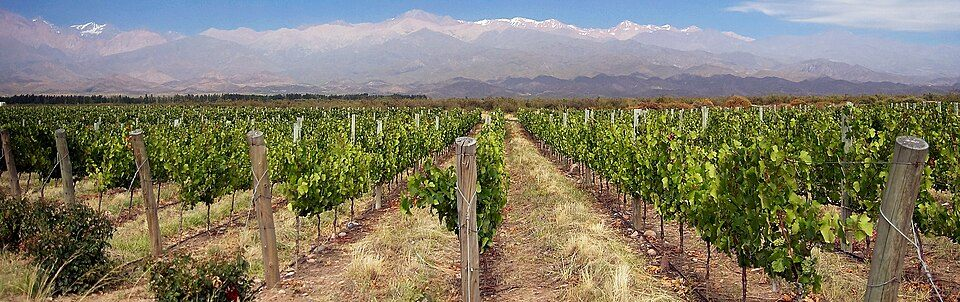</td>
</tr><tr>
<td>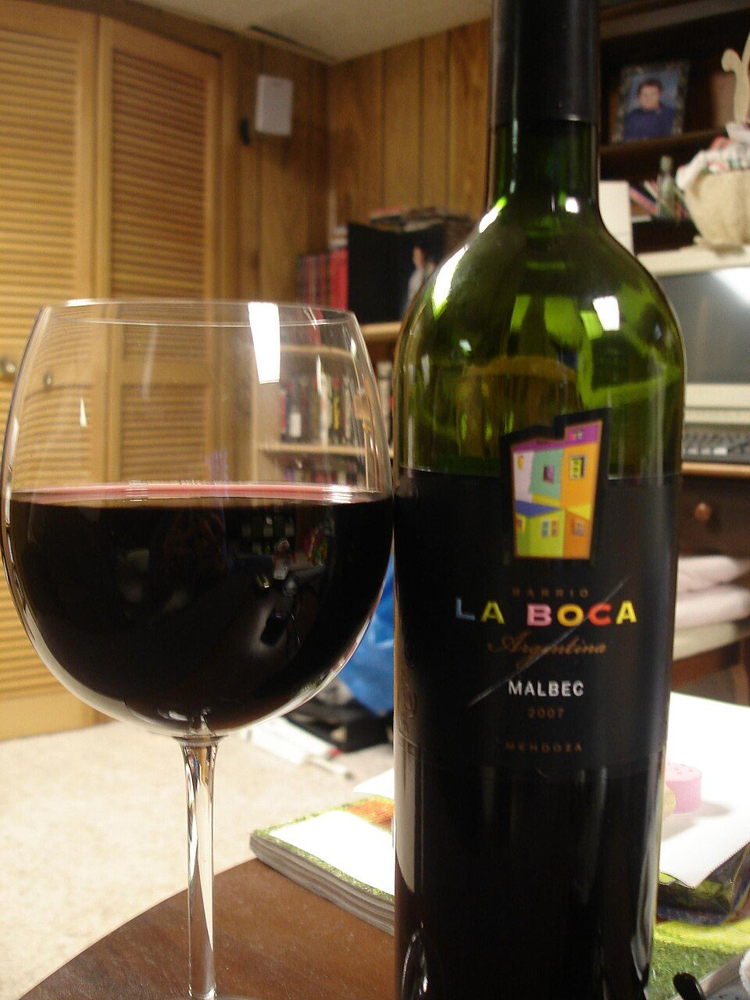</td>
<td>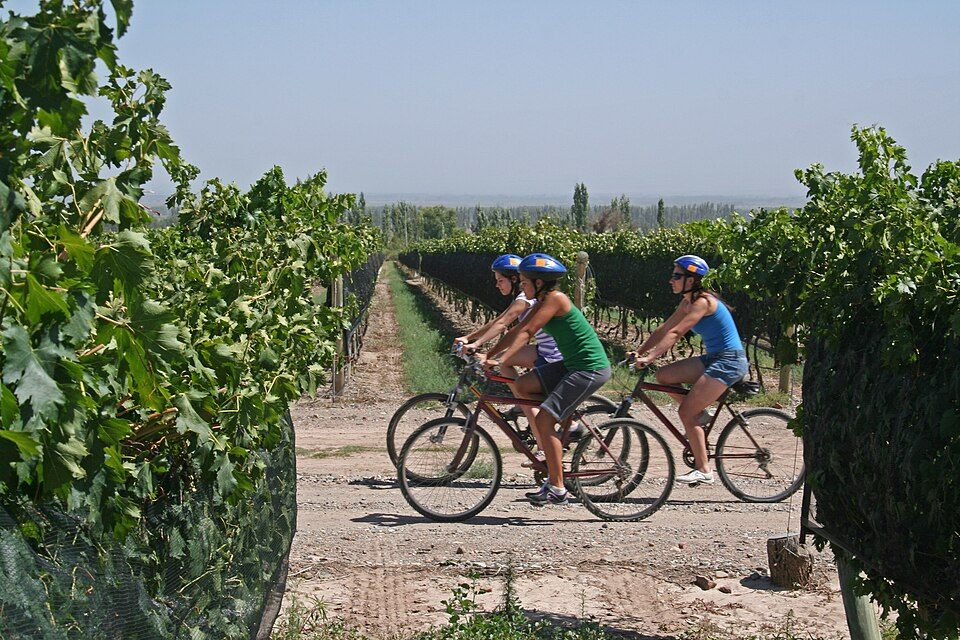</td>
<td>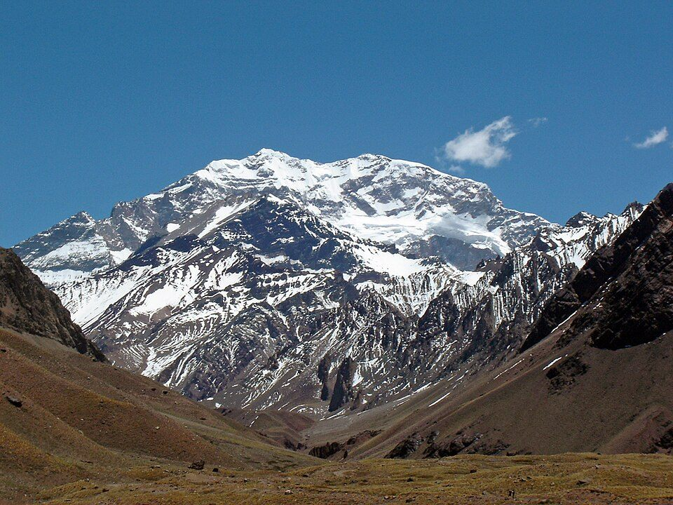</td>
<td>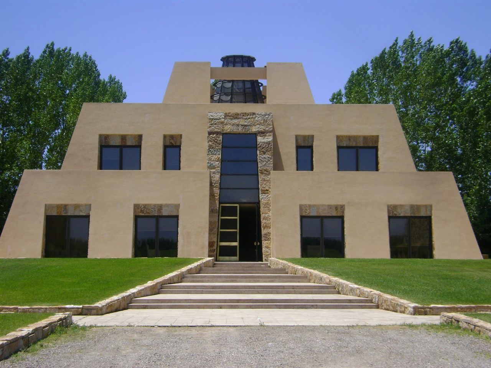</td>
</tr></table>

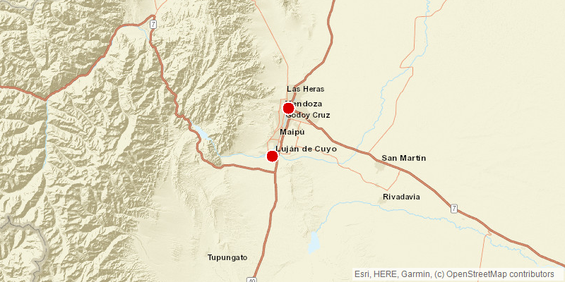
[View on Google Maps ↗](https://www.google.com/maps/place/Mendoza,+Argentina/@-32.8908,-68.8272,11z)

---

#### Day 24 · Friday, Jan 1 — Flight to Mendoza (New Year's Day)

- **Morning**: Flight **BRC → MDZ** (~2 hrs). Note: NYE will be a very late night — set multiple alarms.
- **Afternoon**: Check in to hotel. Rest and recover. A slow walk through Mendoza's **leafy pedestrian streets** and **Plaza Independencia** is the ideal pace.
- **Evening**: Light dinner with your first **Mendoza Malbec** at the source. Early night.

| | |
|---|---|
| **Stay** | Hotel in Mendoza city centre, or in the wine belt: Luján de Cuyo or Chacras de Coria |

---

#### Day 25 · Saturday, Jan 2 — Winery Tour (Bodegas)

- **Full Day**: **Wine tour in the Mendoza wine region** — Argentina's most important wine-producing area, responsible for nearly two-thirds of national wine output:
  - **Maipú** (~15 km east) — bicycle-friendly wine route through dozens of bodegas. Rent bikes for a self-guided tour.
  - **Luján de Cuyo** (~25 km south) — prestige wineries including:
    - **Bodega Catena Zapata** (iconic Mayan pyramid architecture; world-class Malbec)
    - **Achaval Ferrer**, **Clos de los Siete**, **Renacer**
  - **Valle de Uco** (~100 km south) — high-altitude vineyards at 1,200 m with Andes backdrop:
    - **Zuccardi Valle de Uco** (stunning modern architecture; award-winning wines)
  - Book tours/tastings in advance — January is high season.
  - Try a **full asado lunch at a bodega** — an unforgettable combination.
- **Evening**: Return to Mendoza. Final Argentine dinner with bottles of Malbec and Torrontés (white).

| | |
|---|---|
| **Stay** | Hotel in Mendoza |
| **Book** | Winery tours: at least 2–4 weeks in advance for January |

---

### 🏙️ Buenos Aires (Departure)

**Jan 3 · 1 night**

[View on Google Maps ↗](https://www.google.com/maps/place/Buenos+Aires,+Argentina/@-34.6037,-58.3816,13z)

---

#### Day 26 · Sunday, Jan 3 — Last Flight + Final Night

- **Morning**: Flight **MDZ → EZE** (~1.5 hrs). Arrive in Buenos Aires.
- **Afternoon**: Check in to hotel near EZE airport or in the city for a last night. Freshen up and reflect on 26 extraordinary nights.
- **Evening**: **Final Buenos Aires dinner** — treat yourselves at a top parrilla or a restaurant you wanted to try on Day 1. Celebrate an epic journey.

| | |
|---|---|
| **Stay** | Hotel near EZE airport (convenient) or Palermo (livelier last night) |

---

#### Day 27 · Monday, Jan 4 — Departure ✈️

- Transfer to **EZE** with plenty of time. International departures: arrive 3 hours early.
- **Departure: January 4, 2027**.

---

## 🗺️ Practical Tips

### Money

- Bring **USD cash in good condition** (no tears, pen marks, or heavy creases — Argentine banks will reject them). $100 notes preferred.
- Use an official **casa de cambio** or your hotel for exchange. Avoid unofficial street changers.
- ATMs have daily withdrawal limits; extract cash in stages.
- **El Chaltén: NO ATM.** Withdraw before the El Calafate bus. Bring more than you think you need.

### Weather & Clothing

| Region | December–January Conditions | Essentials |
|--------|----------------------------|------------|
| Buenos Aires | Hot, humid (28–35°C) | Light clothes, comfortable walking shoes |
| Iguazú | Very hot and humid (30–38°C) | Light clothes, rain poncho/waterproof |
| Patagonia (Madryn, Ushuaia, Calafate, Chaltén, Bariloche) | Cool–cold, very windy (5–20°C) | **Windproof/waterproof jacket (essential!)**, layers, warm hat, gloves |
| Mendoza | Hot, dry (28–36°C) | Light clothes, sunscreen, hat |

> In Patagonia, weather can change from sunshine to rain to wind in 20 minutes. Always carry layers.

### Safety

- Buenos Aires: Use **Uber, Cabify, or InDriver** rather than street taxis. Avoid walking in La Boca after dark. Be alert in crowded areas.
- Patagonian trails: Stay on marked paths. Tell someone your route. Carry water and snacks.
- Sun protection: The UV index in Patagonia is surprisingly high. Use SPF 50+.

### Language

- Basic Spanish is very helpful outside Buenos Aires. Argentines speak a distinctive dialect with *vos* instead of *tú*.
- Key phrases: *¿Cuánto cuesta?* (How much?), *Una mesa para cuatro* (A table for four), *La cuenta, por favor* (The bill please), *Sin hielo* (No ice — order drinks sin hielo if you want them without ice to avoid stomach issues).

### Flights & Booking

- Book domestic flights on **Aerolíneas Argentinas** (most reliable, best network), or **JetSMART / Flybondi** (cheaper but less reliable).
- December–January is Argentina's peak domestic travel season. Book all flights **at least 3–4 months ahead**.
- Internal flights: luggage limits are typically 23 kg hold + 8 kg hand luggage on Aerolíneas.

### Visa & Entry

- **Argentina**: Citizens of Israel, the EU, UK, US, Australia, and most Western countries enter **visa-free** for up to 90 days. No advance registration required.
- **Brazil (Day 4)**: As of 2025, Israeli passport holders do not require a visa for Brazil short tourist visits. **Verify this is still in effect** before travel at the Israeli Ministry of Foreign Affairs site or the Brazilian consulate.
- **Passport validity**: Ensure all passports are valid for at least 6 months beyond the Jan 4 departure date — i.e., valid through at least **July 2027**.
- **Proof of onward travel**: Argentine immigration may ask to see evidence of a return or onward flight. Have the Jan 4 departure confirmation on your phone.
- Always verify current requirements at [migraciones.gov.ar](https://www.migraciones.gov.ar) and your own government's travel advisory before departure.

---

### Budget Snapshot (Per Person)

Estimated mid-range costs in USD. Based on splitting car rentals and accommodation 4 ways.

| Category | Est. Cost (USD) |
|----------|----------------|
| International flights (return) | $1,000 – 1,800 |
| 8 domestic flights | $600 – 1,000 |
| Accommodation (26 nights, shared) | $800 – 1,400 |
| Car rentals × 3 segments (÷4) | $150 – 250 |
| Perito Moreno ice trek | $80 – 150 |
| Martillo Island penguin tour | $60 – 100 |
| Whale watching (Península Valdés) | $60 – 80 |
| Iguazú boat safari | $40 – 60 |
| Meals & drinks (~$35–50/day × 26) | $910 – 1,300 |
| National park entry fees | $60 – 100 |
| Activities, tours & incidentals | $200 – 400 |
| **Total estimate** | **$4,000 – 6,640** |

> Figures are rough guides. Exchange rate swings, flight timing, and how much Malbec you consume will all move the needle. El Chaltén is cash-only — build in a cash buffer before the bus from El Calafate.

---

### Useful Apps

| App | Purpose |
|-----|--------|
| **Uber / Cabify** | Safe rides in Buenos Aires and other cities |
| **Despegar** | Argentine flight and hotel aggregator |
| **Google Maps** | Download offline maps for each region before arriving — mobile data can be patchy in Patagonia |
| **WhatsApp** | Universal communication method across Argentina |
| **Airalo / Holafly** | eSIM data plans — strongly recommended over expensive international roaming |
| **XE Currency** | Exchange rate reference |
| **AllTrails / Wikiloc** | Trail maps and GPS tracks for El Chaltén and Bariloche hikes |
| **Infobae / Windy** | Patagonian wind and weather forecasting |

---

### Emergency & Useful Numbers

| | |
|---|---|
| **Argentine emergency** | 911 |
| **Tourist police (Buenos Aires)** | +54 11 4346-5748 |
| **EZE Airport information** | +54 11 5480-6111 |
| **Aerolíneas Argentinas** | 0810-222-86527 |
| **Argentine Red Cross** | 107 |

---

*¡Buen viaje, muchachos! Have the adventure of a lifetime.* 🇦🇷
